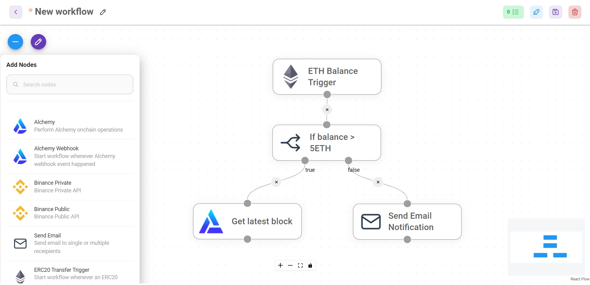

# Outerbridge - Automate Web3 and Web2 applications

Outerbridge is a low code/no code workflow automation application, focusing on integrating both on-chain and off-chain applications. The project is licensed under [Apache License Version 2.0](LICENSE.md), source available and free to self-host.




## Why another workflow automation tool?

There are many awesome automation tools out there, however there isn't one that has the built-in logic of interacting/consuming information from blockchains. Hence, Outerbridge is created to allow people building workflows involving on-chain and off-chain applications, with simple drag and drop interface. 

## Demo
Here is the [demo](https://demo.outerbridge.io) version of Outerbridge hosted using AWS t2-micro.

Detail [documentation](https://gist.github.com/HenryHengZJ/f8fb7dae0300d18a104cc4a29ec51a7a) on how to setup using AWS t2-micro with your custom domain name.

Watch [Outerbridge Quickstart Demo](https://www.youtube.com/watch?v=x-AfrkKvZ4M) on Youtube (4mins)

## Quickstart
1. Install MongoDB from [here](https://www.mongodb.com/try/download/community?tck=docs_server).
1. `npm install -g outerbridge`
2. `npx outerbridge start`
3. Open http://localhost:3000


## Developers

### Prerequisite
Lerna, MongoDB and Yarn have to be installed before setting up the project.

### Lerna
Outerbridge has 3 different modules in a single mono repository.
- `server`: Node backend to serve API logics
- `ui`: React frontend
- `components`: Nodes and Credentials of applications

Lerna is used to link these modules together.
```
npm install -g lerna
```

### MongoDB
Outerbridge uses MongoDB as database. Download and install one [here](https://www.mongodb.com/try/download/community?tck=docs_server).

### Yarn
```
npm install -g yarn
```

### Setup
1. Clone the repository
	```
	git clone https://github.com/Outerbridgeio/Outerbridge.git
	```

2. Go into repository folder
	```
	cd Outerbridge
	```

3. Install all dependencies of all modules and link them together:
	```
	yarn bootstrap
	```

4. Build all the code:
	```
	yarn build
	```

5. Start the app:
	```
	yarn start
	```
	You can now access the app on http://localhost:3000

6. For development build:
	```
	yarn run dev
	```
	Any code changes will reload the app automatically on http://localhost:8080

## Documentation
Official Outerbridge docs can be found under: https://docs.outerbridge.io

## Support
Feel free to ask any questions, raise problems, and request new features in [discussion](https://github.com/Outerbridgeio/Outerbridge/discussions)

## Contributing
See [contributing guide](CONTRIBUTING.md). Reach out to us at [Discord](https://discord.gg/Y9VE4ykPDJ) if you have any questions or issues.

## License
Source code in this repository is made available under the [Apache License Version 2.0](LICENSE.md).
